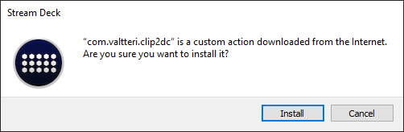

# Installation
## 1. Get [twitch api key](https://id.twitch.tv/oauth2/authorize?client_id=l0a7jchcfebrzsoz3mr2v9s72vmrdg&redirect_uri=http://localhost&response_type=token&scope=clips:edit)
## 2. Copy access token
You will be redicted to `http://localhost/#access_token=<access_token>&scope=clips%3Aedit&token_type=bearer`  
Page says "This site can't be reached" but copy the access token from url  
  
**Save** the token somewhere **secure** for future usage.
## 3. Install application
1. Download latest release. Note download only the com.valtteri.clip2dc.streamDeckPlugin
2. Run the com.valtteri.clip2dc.streamDeckPlugin and click install form Stream Deck app  
  

## 4. Application settings

1. Set title (optional)
2. Give channel name
3. Add Twitch access token you got before
4. Add discord webhook url
5. If you want to open clip editor afterwards select yes. This opens Twitch clip editor in browser after clip is created.
6. Click save
